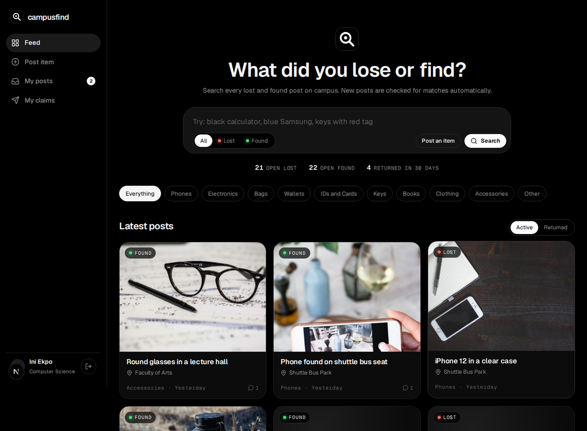

# campusfind

Lost and found for the University of Uyo. Post what you lost or found, search everything on campus, and let the matcher suggest posts that look like the same item. Owners send a claim, the poster accepts it and marks the item returned.



Full documentation with annotated screenshots: [docs/CampusFind-Documentation.pdf](docs/CampusFind-Documentation.pdf)

## Features

- Post lost or found items with a photo, category, place, date and details
- Search and filter by text, Lost/Found, category, and Active or Returned
- Possible matches on every post: same category, shared words (with synonyms such as iPhone to phone), same place and a sensible date gap, scored 0 to 100 with reasons
- Contact the poster by email, phone or WhatsApp
- Claims: one per student per item, visible only to the poster; accepting one marks the item claimed and declines the rest
- Mark as returned closes the post
- My posts and My claims pages scoped to the signed-in student
- Inline validation with Zod; works on phones

## Demo login

`student@uniuyo.edu.ng` / `student123` (prefilled). Every seeded student uses the same password, for example `idara.umoh@student.uniuyo.edu.ng`.

For a live demo, `public/demo/found-calculator.jpg` is a sample photo to upload with a found calculator post.

## Tech stack

Next.js 16 (App Router, Server Components, Server Actions), TypeScript (strict), Drizzle ORM with PostgreSQL and drizzle-kit migrations, Zod, bcryptjs and jose sessions, lucide-react icons, DiceBear avatars, Fontsource (Geist), Vitest and Playwright.

## Quick start

```bash
service postgresql start
sudo -u postgres createdb campusfind
sudo -u postgres createdb campusfind_test
cp .env.example .env    # set DATABASE_URL and SESSION_SECRET
npm install
npm run db:migrate
npm run db:seed
npm run dev             # http://localhost:3000
```

Set `CAMPUSFIND_TODAY=2026-10-05` to freeze the clock.

## Scripts

| Script | What it does |
| --- | --- |
| `npm run dev` | Development server |
| `npm run build` / `npm start` | Production build and server |
| `npm run start:prod` | Migrate, seed if empty, start on 0.0.0.0 (Railway) |
| `npm run db:generate` / `db:migrate` / `db:seed` | New migration, apply, reset and seed |
| `npm run test:unit` / `test:integration` / `test:e2e` | Test suites |
| `npm run docs:pdf` | Rebuild the PDF documentation |

## Deployment

Railway project `school-projects`, service `campus-find` with its own `campus-find-postgres` database. `railway.json`: build `npm run build`, start `npm run start:prod`, health check `/api/health` (pings the database).

## Image credits

Item and campus photos are Creative Commons images found through Openverse. Credits are in `public/images/items/credits.json` and `public/images/scenes/credits.json`.
